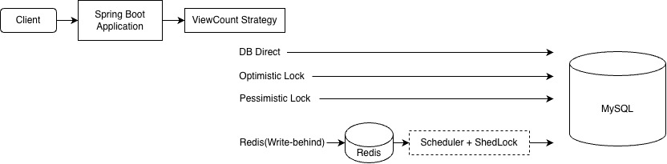

## 게시판 조회수 동시성 프로젝트

### 프로젝트 개요

Spring Boot + JPA 환경에서 게시글 조회수 증가 로직의 동시성 문제 해결 전략을 실험하는 프로젝트입니다.  
조회수 증가 로직에 대해 다음 네 가지 전략을 비교 실험합니다.

- DB 직접 증가
- 낙관적 락(Optimistic Lock)
- 비관적 락(Pessimistic Lock)
- Redis 기반 조회수 집계 (Write-Behind 패턴)

---

### 기술 스택

Backend
- Java
- Spring Boot
- Spring Data JPA

Database
- MySQL
- Redis

Infra
- Docker

---

### 기술적 도전 과제 및 해결 전략

조회수 증가는 단순한 카운터처럼 보이지만 동시 요청의 경우 여러 기술적 문제가 발생할 수 있습니다.
이 프로젝트는 아래 3가지 관점에 맞춰 비교합니다.

- **정합성**  
  동시 요청 환경에서도 조회수가 누락 없이 정확하게 증가하는가  
  → 각 전략에서 발생할 수 있는 Lost Update 문제를 검증

- **처리량**  
  높은 조회 트래픽에서도 시스템이 안정적으로 요청을 처리할 수 있는가  
  → 각 전략의 처리량 및 DB 쓰기 부하 특성을 비교

- **운영 복잡도**  
  실제 서비스 환경에서 장애 대응, 복구, 운영 부담을 얼마나 수반하는가  
  → 재시도, 락 관리, flush, 장애 복구 등 운영 관점의 복잡도를 비교

---

### 시스템 구조

#### 시스템 아키텍처



---

### 조회수 증가 전략

#### DB 직접 증가

가장 기본이 되는 전략으로 단일 UPDATE 쿼리를 사용해 DB의 조회수 컬럼을 직접 증가시키는 방식입니다.  
별도의 캐시나 락 없이 조회수 증가가 즉시 DB에 반영됩니다.

- 설계 의도
  - 구현이 단순하고 운영 복잡도가 낮은 전략으로 선택했습니다.
  - 트래픽이 크지 않은 환경에서 DB 직접 증가만으로 충분한지 검증하기 위해 선택했습니다.

- 가설
  - 소규모~중간 규모 트래픽에서는 즉시성, 구현 난이도, 운영 비용 측면에서 현실적인 선택지가 될 것입니다.
  - 조회 요청이 많아질수록 DB write 부하가 집중되어 병목이 발생할 가능성이 있습니다.

#### 낙관적 락(Optimistic Lock)

낙관적 락 전략에서는 엔티티의 `@Version` 필드를 기반으로 충돌을 감지하여 실패 시 재시도하는 구조를 사용합니다.

- 설계 의도
    - 조회수처럼 동일 Row에 대한 충돌이 많은 환경에서 낙관적락이 실제로 유효한지 검증하고자 선택했습니다.

- 가설
    - 충돌이 드문 경우에서는 적합하지만 조회수처럼 동일 Row에 대한 충돌이 많은 경우 재시도 비용이 증가하여 비효율적일 것입니다.
    - 재시도 횟수가 제한된 상황에서 최종적으로 반영되지 못한 요청이 조회수 누락으로 이어질 가능성이 있습니다.


#### 비관적 락(Pessimistic Lock)

비관적 락 전략에서는 `@Lock(PESSIMISTIC_WRITE)` 를 사용해 DB 레벨에서 해당 row에 대한 쓰기 락을 획득한 뒤 조회수 증가를 처리합니다.
락이 해제될 때까지 다른 트랜잭션은 해당 Row에 접근할 수 없기 때문에 동시 업데이트로 인한 Lost Update를 방지할 수 있습니다.

- 설계 의도
    - DB락을 사용하는 대표적인 동시성 제어 전략으로 락 기반 접근이 실제로 어떤 성능을 보이는지 검증하고자 선택했습니다.

- 가설
    - 정합성 측면에서 가장 안정적일 것입니다.
    - 동시에 많은 요청이 발생할 경우 응답 지연이 발생하고 그 결과 처리량이 감소될 것입니다.

#### Redis 기반 조회수 집계 (Write-Behind)

Redis 기반 조회수 집계에서는 조회 요청 시 직접 DB를 업데이트하지 않고 Redis Hash에 조회수 증가를 누적합니다.  
누적된 조회수는 Scheduler를 주기적으로 실행하여 DB에 반영합니다.  
또한 멀티 인스턴스 환경에서 Flush 작업이 중복으로 실행되지 않도록 ShedLock을 적용했습니다.

- 설계 의도
    - 조회 요청이 많은 서비스에서 모든 요청을 DB로 처리하면 DB 부하가 증가할 수 있습니다.
    - 이를 완화하기 위해 조회수 증가를 Redis에 누적하고 주기적으로 DB에 반영하는 Write-Behind 구조를 선택했습니다.

- 가설
    - DB 직접 증가/락 기반 전략에 비해 DB의 쓰기 횟수를 줄여 처리량을 확보할 수 있을 것입니다.
    - 다만 Flush 이전에 Redis 장애가 발생할 경우 데이터 유실 가능성이 존재합니다.

---

#### 전략 비교

- **DB 직접 증가**
  - 장점: 구현이 가장 단순하고 운영 비용이 낮음.
  - 단점: 동시성 제어가 없으면 Lost Update 가능, 트래픽 증가 시 DB write 병목.
- **낙관적 락(Optimistic Lock)**
  - 장점: 락 자원을 점유하지 않으면서도 정합성을 확보할 수 있고 충돌이 적은 도메인에 유리함.
  - 단점: 조회수처럼 충돌이 잦은 경우 재시도 비용과 실패율이 커질 수 있음.
- **비관적 락(Pessimistic Lock)**
  - 장점: 정합성 측면에서 가장 직관적이고 안정적.
  - 단점: 동시 요청이 많아질수록 락 대기로 인한 처리량/응답 시간 저하 가능성이 큼.
- **Redis 기반 조회수 집계 (Write-Behind)**
  - 장점: DB 직접 쓰기를 줄여 처리량과 확장성에서 가장 유리할 것으로 예상, 또한 조회 시 Redis 값을 함께 사용하도록 설계할 경우 즉시성을 보완할 수 있음
  - 단점: Flush 설계가 미흡하면 Redis 장애/네트워크 이슈 시 데이터 유실 또는 지연 반영이 발생할 수 있음.

이 프로젝트에서는 위 네 가지 전략을 게시글 조회수에 적용한 뒤 부하 테스트를 통해  
어떤 트래픽 패턴과 시스템 제약에서 어떤 전략이 가장 현실적인 선택인지를 정량적으로 비교합니다.
 
---

### 부하 테스트

#### 테스트 환경

- 도구: k6
- 시나리오: 단일 게시글에 대한 집중 조회
- 실행 방식: 동일 조건에서 2회 실행 후 두 번째 결과 기준

#### 테스트 조건

| 구분 | 조건 1 | 조건 2 |
|------|--------|--------|
| 목표 RPS | 300 | 500 |
| 테스트 시간 | 5분 | 5분 |
| 램프업 단계 | 50 → 150 → 300 → 유지 | 100 → 300 → 500 → 유지 |

#### 결과

**300 RPS**

| 전략 | avg(ms) | p95(ms) | 에러율 | 조회수 누락 |
|------|---------|---------|--------|------------|
| DB 직접 증가 | 2.04 | 3.35 | 0.001% | 1건 |
| 낙관적 락 | 2.17 | 3.15 | 0.061% | 45건 |
| 비관적 락 | 1.97 | 3.11 | 0.022% | 16건 |
| Redis | 1.85 | 3.11 | 0.001% | 2건 |

**500 RPS**

| 전략 | avg(ms) | p95(ms) | 에러율 | 조회수 누락 |
|------|---------|---------|--------|------------|
| DB 직접 증가 | 1.49 | 2.22 | 0.004% | 5건 |
| 낙관적 락 | 2.25 | 4.45 | 1.80% | 2,243건 |
| 비관적 락 | 1.62 | 2.51 | 0.012% | 15건 |
| Redis | 1.29 | 2.03 | 0.002% | 3건 |

#### 분석

**낙관적 락**  
300 RPS에서는 45건 누락으로 영향이 제한적이었으나 500 RPS에서는 누락이 2,243건으로 급증하며 에러율 임계값을 초과했습니다.  
동일 Row에 대한 충돌이 빈번해질수록 재시도 한계를 초과하는 요청이 기하급수적으로 증가하기 때문입니다.  
조회수처럼 충돌이 잦은 작업에서는 부하가 높아질수록 낙관적 락이 적합하지 않음을 확인했습니다.

**DB 직접 증가**  
단일 UPDATE 기반 DB 직접 증가는 500 req/s 조건에서도 낮은 실패율과 안정적인 응답 시간을 유지했습니다.
조회수 증가처럼 단순한 카운터에서는 초기 단계에서 별도 캐시 없이도 구현 단순성과 정합성을 동시에 확보할 수 있는 기준 전략이 될 수 있음을 확인했습니다.

**DB 직접 증가 vs 비관적 락**  
두 전략 모두 성능 수치가 유사하게 나타났습니다.  
MySQL의 단일 UPDATE 쿼리는 내부적으로 묵시적 row lock을 사용하기 때문에 비관적 락과 동작 특성이 유사하게 나타날 수 있습니다.  
이로 인해 두 전략 간 성능 차이가 미미하게 나타난 것으로 추측됩니다.

**Redis (Write-Behind)**  
전 구간에서 가장 낮은 응답시간, p95, 실패율을 보였습니다.  
DB write 없이 Redis에 누적 후 주기적으로 flush하는 구조가 고부하 환경에서 스레드 점유 시간을 단축해 응답 속도 측면에서 유리하게 작동했습니다.

**소수 실패 건에 대하여**  
DB 직접 증가, 비관적 락, Redis에서 발생한 소수의 실패는 k6(Docker 컨테이너)와 애플리케이션(로컬) 간 네트워크 연결 과정에서 발생한 TCP 타임아웃으로 확인되었으며 동시성 제어 로직과는 무관합니다.

#### 결론

| 전략 | 정합성 | 처리량 | 운영 복잡도 | 적합한 환경 |
|------|--------|-----|------------|------------|
| DB 직접 증가 | △ | ○ | 낮음 | 소규모, 단순성이 우선인 경우 |
| 낙관적 락 | △ | x | 중간 | 충돌이 드문 도메인 |
| 비관적 락 | ○ | ○ | 중간 | 정합성이 중요하고 트래픽이 크지 않은 경우 |
| Redis | ○ | ○ | 높음 | 고트래픽, DB 쓰기 부하 분산이 필요한 경우 |

---

### 트러블 슈팅

#### 1. Optimistic Lock 적용 시 조회수 누락 문제

##### 문제 상황

조회수 증가 로직에서 동시성 문제를 해결하기 위해 JPA의 `@Version` 기반 낙관적 락을 적용했습니다.
동시 요청 환경에서 정상 동작하는지 확인하기 위해 동시성 테스트를 수행했습니다.

테스트 조건

- 요청 수: 500
- 동시 스레드 수: 32

하지만 테스트 결과 일부 요청에서 조회수가 증가하지 않는 문제가 발생했습니다.

##### 원인 분석

낙관적 락은 동일한 데이터를 동시에 수정할 경우 버전 충돌을 감지하여 트랜잭션을 실패시키는 방식으로 동작합니다.

```

Thread A → version 1 조회
Thread B → version 1 조회

Thread A → update 성공 (version 2)
Thread B → update 실패 (OptimisticLockException)

```

충돌이 발생하면 두번째 트랜잭션은 실패하게 됩니다.

조회수 증가 로직에서는 실패가 그대로 조회수 누락으로 이어졌습니다.

따라서 충돌이 발생했을 때 정합성을 보장하기 위해 재시도 로직이 필요했습니다.

##### 해결 과정

재시도 로직을 구현하는 과정에서 트랜잭션 처리 문제가 발생했습니다.

1. `OptimisticLockException`이 발생하면 해당 트랜잭션은 rollback 상태가 되기 때문에 같은 트랜잭션 내부에서는 재시도를 수행할 수 없었습니다.

    이를 해결하기 위해 새로운 트랜잭션에서 재시도를 수행하도록 ```REQUIRES_NEW```를 적용했습니다.

2. 하지만 같은 클래스에서 메서드를 호출하는 경우 Spring의 프록시 기반 트랜잭션이 적용되지 않는 문제가 있었습니다.

    이를 해결하기 위해 재시도 로직을 별도의 클래스로 분리하여 트랜잭션 프록시가 적용되도록 수정했습니다.

3. 또한 초기에는 재시도 횟수를 50회로 설정했지만 동시 요청 환경에서 재시도가 반복되면서 처리 시간이 크게 증가하는 문제가 발생했습니다.

    재시도 횟수를 50회로 설정했을 때 모든 요청의 정합성은 확보되었지만 재시도 증가로 인해 DB 부하와 처리 시간이 크게 증가했습니다.

    테스트 결과 대부분의 충돌은 초기 몇 회의 재시도 내에 해결되었고 이후 재시도는 성공률 대비 성능 비용이 크게 증가했습니다.

    따라서 재시도 횟수를 3~5회로 제한하여 성공률과 처리 성능 간의 균형을 맞추도록 조정했습니다.

##### 결과

낙관적 락을 적용하면 데이터 충돌을 감지할 수 있지만 조회수 증가처럼 동일 Row에 대한 충돌이 빈번한 작업에서는 재시도 비용이 크게 증가합니다.

특히 다음 같은 단점이 두드러졌습니다.

- 충돌 발생 빈도 증가
- 재시도 로직 필요
- 재시도 로직으로 인한 처리 시간 증가

따라서 조회수 증가와 같이 동시 업데이트가 자주 발생하는 작업에서는 낙관적 락이 적합하지 않다고 판단했습니다.

##### 정리

낙관적 락은 충돌 가능성이 낮은 데이터 수정에는 효과적이지만 조회수 증가처럼 충돌이 빈번한 작업에서는 재시도 비용이 커지기 때문에 적합하지 않았습니다.

이 경험을 통해 동시성 문제를 해결할 때 단순히 락을 적용하는 것이 아니라 작업 특성에 맞는 동시성 전략을 선택하는 것이 중요하다는 점을 확인했습니다.

---

#### 2. Redis Flush 동시 실행 검증 문제

##### 문제 상황

조회수 증가 요청이 많을 경우 DB에 직접 반영하면 쓰기 부하가 증가할 수 있기 때문에 조회수 증가량을 Redis에 누적한 뒤
scheduler를 통해 주기적으로 DB에 반영하는 Write-behind 구조를 적용했습니다.

이때 `@Scheduled`는 애플리케이션 인스턴스마다 실행되기 때문에 멀티 인스턴스 환경에서는 동일한 flush 작업이 여러 번 실행될 가능성이 있습니다.

따라서 분산락을 적용하는 것뿐 아니라 flush가 실제로 동시에 실행되지 않는지 검증할 필요가 있었습니다.

##### 해결 과정

분산락을 적용했지만 실제로 flush가 한 번만 실행되는지 검증하는 것이 또 다른 문제였습니다.

초기에는 delay 기반으로 flush 실행 시간을 늘려 동시 실행 상황을 재현하려 했지만 이 방식은 테스트 시점을 안정적으로 제어하기 어려웠습니다.

그래서 flush 내부 특정 지점에서 실행을 제어할 수 있도록 테스트용 hook 구조를 도입했습니다.

이 방식으로 flush 실행 중인 상태를 유지한 채 추가 flush 요청을 발생시켜 분산락이 실제로 동일 시점에 하나의 flush만 허용하는지 검증할 수 있었습니다.

##### 결과

hook 기반 테스트 구조를 통해 다음을 검증할 수 있었습니다.

- flush 실행 중 다른 flush가 동시에 진입
- flush가 동시에 실행될 경우 동일 데이터가 중복 반영 여부
- 분산락이 flush 임계 구역을 올바르게 보호하는지 여부

flush 내부 특정 지점에서 실행을 제어할 수 있도록 테스트용 hook 구조를 도입했습니다.  
이를 통해 flush 진행 중인 상태를 인위적으로 유지하고 동일 시점에 추가 flush 요청을 발생시켜
분산락이 실제로 동시 실행을 차단하는지 검증할 수 있었습니다.

##### 정리

Redis flush 구조는 단순히 Redis에 누적된 데이터를 DB로 반영하는 작업처럼 보이지만
멀티 인스턴스 환경에서는 동일한 flush 작업이 동시에 실행될 수 있다는 점을 고려해야 했습니다.

이를 해결하기 위해 분산락을 적용하고 실제로 flush가 동시에 실행되지 않는지 검증할 수 있는 테스트 구조를 구성했습니다.

이 과정을 통해 멀티 인스턴스 환경에서 조회수 집계 작업의 정합성을 유지하기 위한 실행 제어와 검증 방법을 함께 설계할 필요가 있음을 확인했습니다.